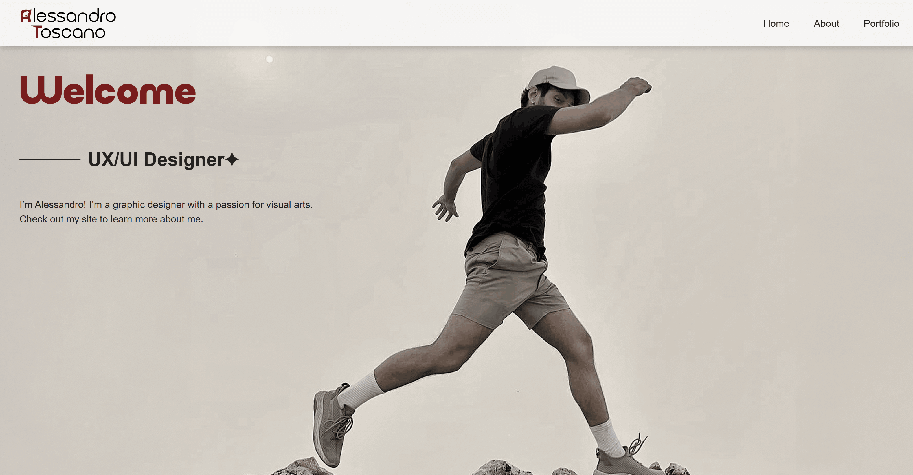
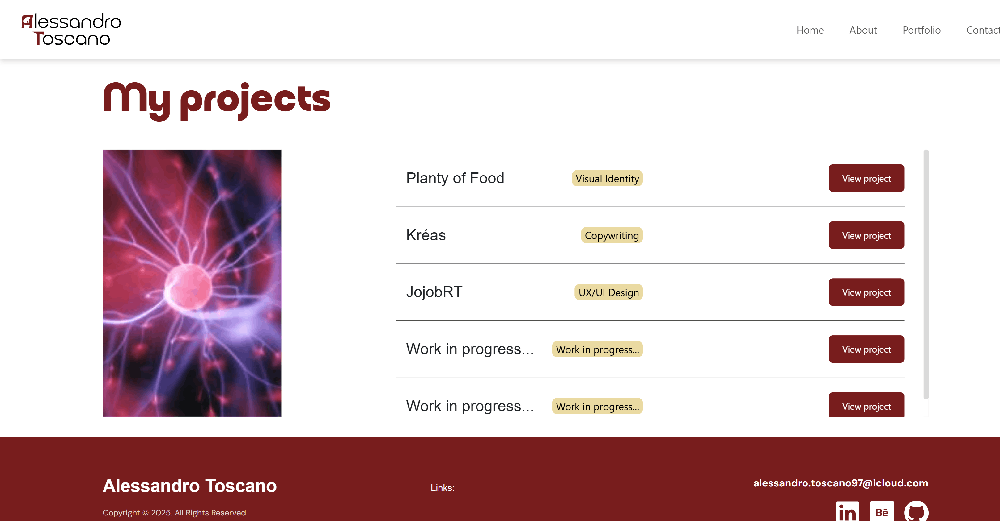

# Alessandro Toscano – UX/UI Designer Portfolio

🔗 Live Website:  
https://aleuxui97.github.io/il-mio-sitoweb/

Personal portfolio website showcasing my work as a UX/UI Designer.
The site presents selected projects, design approach, professional background, and contact information.

The goal of this project is to demonstrate front-end development skills combined with user-centered design principles.


## Tech Stack

- HTML5
- CSS3
- Bootstrap 5
- Sass (SCSS)
- JavaScript
- GitHub Pages (deployment)
  
  
## Project Structure

```
IL-MIO-SITOWEB/
│
├── index.html
├── about-me/
│   └── index.html
│
├── contacts/
│   └── index.html
│
├── portfolio/
│   ├── index.html
│   ├── Copywriting/
│   │   └── index.html
│   ├── JojobRT/
│   │   └── index.html
│   └── Planty-of-food/
│       └── index.html
│
├── assets/
│   ├── bootstrap/
│   ├── font/
│   ├── img/
│   ├── pdf/
│   └── sass/
│
├── dist/
│   └── css/
│
└── README.md
```

If editing SCSS files:

```bash
sass assets/sass:dist/css --watch
```


## Run Locally

```bash
git clone https://github.com/AleUXUI97/il-mio-sitoweb.git
cd il-mio-sitoweb
open index.html
```

## Preview




## Features

- Responsive layout  
- Modular page structure  
- Project-based portfolio navigation  
- SEO meta tags & Open Graph integration  
- Custom favicon setup  
- Structured SCSS architecture  

## To Do

- Optimize performance (image compression & lazy loading)  
- improve about me page 
- add opening animations
## License

This project is for educational and portfolio purposes.